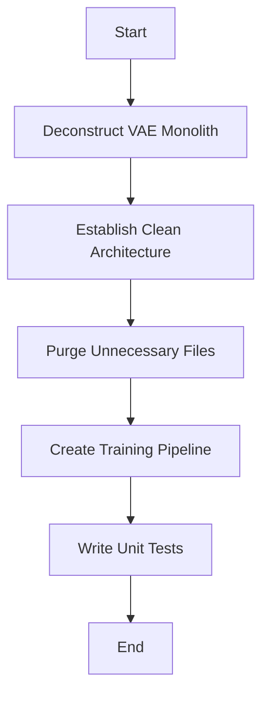

# v3 Refactoring Plan

This plan outlines the steps to refactor the `v3` codebase into a clean, modular, and production-ready foundation for the "Disentangled Representation" research direction.

## Phase 1: Code Restructuring and Simplification

- [ ] **Deconstruct the Monolith**: Break down the `DisentangledVAE` into separate, reusable components:
  - [ ] `Encoder`: A standalone NeuroSnake encoder.
  - [ ] `Decoder`: A standalone KAN-Liquid decoder.
  - [ ] `Classifier`: A standalone classifier head.
  - [ ] `VAE`: A VAE model that uses the Encoder and Decoder.
- [ ] **Establish a Clean Architecture**: Create a new, top-level `v3` directory structure that reflects the new, modular architecture.
- [ ] **Purge the Unnecessary**: Delete all the experimental models, research artifacts, and other clutter that doesn't directly support the disentanglement goal.

## Phase 2: Pipeline and Testing

- [ ] **Create a Production-Ready Training Pipeline**: Develop a new training script that is clean, well-documented, and easy to use.
- [ ] **Write Comprehensive Unit Tests**: Write a full suite of unit tests for the new, modular components.

## Mermaid Diagram

