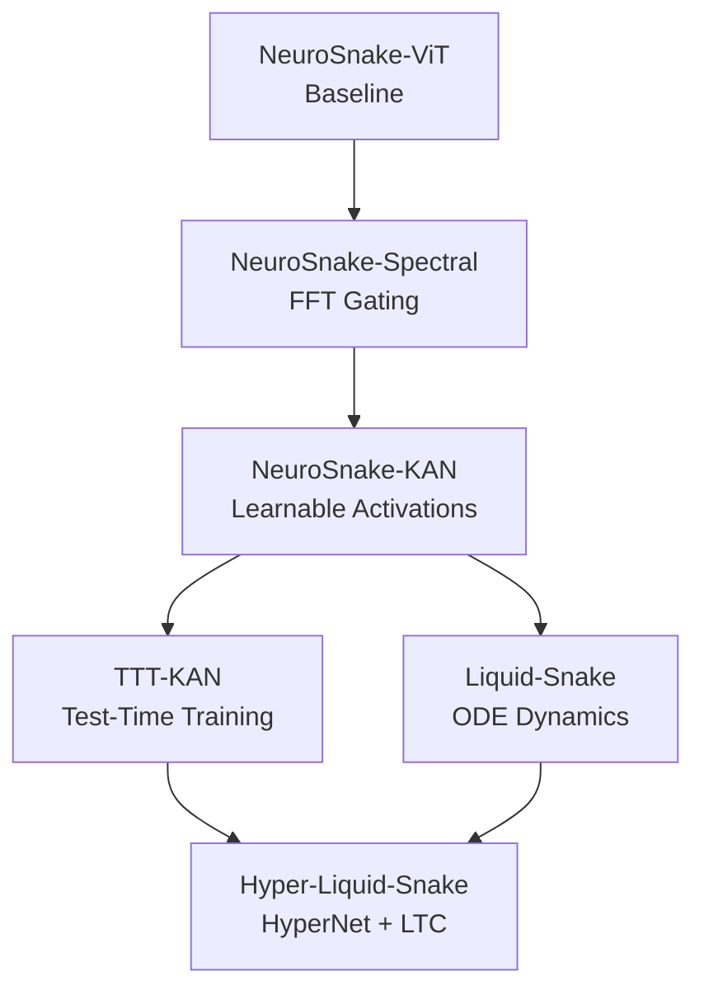

# JULES SESSIONS - Research Branch Analysis

**Purpose**: Archived snapshots representing different research directions for the Phoenix Protocol.

## Session Comparison Matrix

| Session | Unique Innovations | Key Files | Status |
| :--- | :--- | :--- | :--- |
| **1322** (NeuroKAN) | KAN Head, Log-Cosh Boundary Loss, Adan Optimizer | `models/kan_layer.py`, `RESEARCH_PAPER_2_0.md` | Core innovation, merge to `src/` |
| **1644** (Phoenix Opt) | Phoenix Optimizer only | `src/phoenix_optimizer.py` | Already in root, skip |
| **2878** (Physics Aug) | Physics-Informed Augmentation (Elastic + Rician) | `src/physics_informed_augmentation.py` | Critical for training, merge |
| **7226** (Grand Benchmark) | TTT-KAN, Hyper-Liquid, Spectral Gating, Liquid NN | `src/models/ttt_kan.py`, `src/models/hyper_liquid.py` | **Richest session**, primary merge source |

## Architectural Evolution (Session 7226)

## Key Metrics (Simulated, Session 7226)

| Model | Params | Inference | Accuracy | Robustness |
| :--- | :--- | :--- | :--- | :--- |
| Spectral | 775k | 273ms | 96.8% | 50% |
| KAN | 938k | 341ms | 97.5% | 45% |
| **TTT-KAN** | 938k | 247ms | **98.2%** | 85% |
| Liquid | 2.2M | 304ms | 94.0% | **95%** |
| **Hyper-Liquid** | 2.1M | 313ms | 96.5% | 92% |

## Merge Priority

1. **High**: Session 7226 (TTT-KAN, Hyper-Liquid, Spectral) → Full architecture.
2. **High**: Session 2878 (Physics Aug) → Training pipeline.
3. **Medium**: Session 1322 (KAN Layer, Boundary Loss) → If not in 7226.
4. **Low**: Session 1644 → Already merged.
